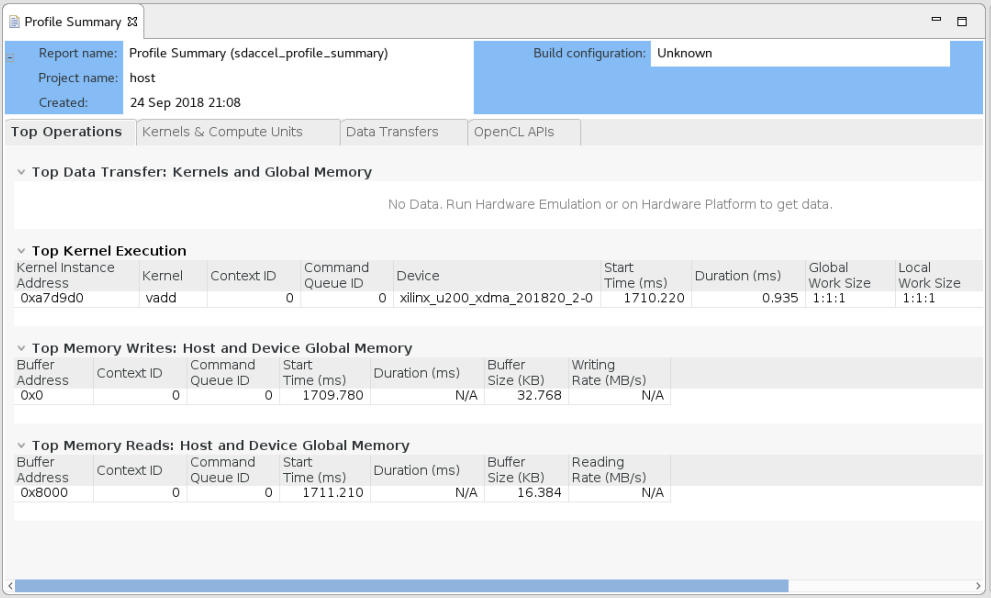
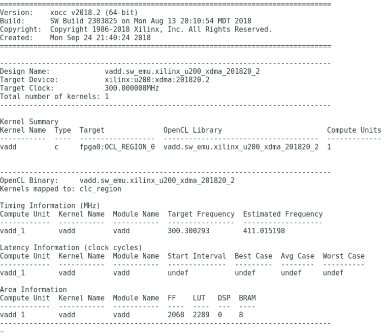
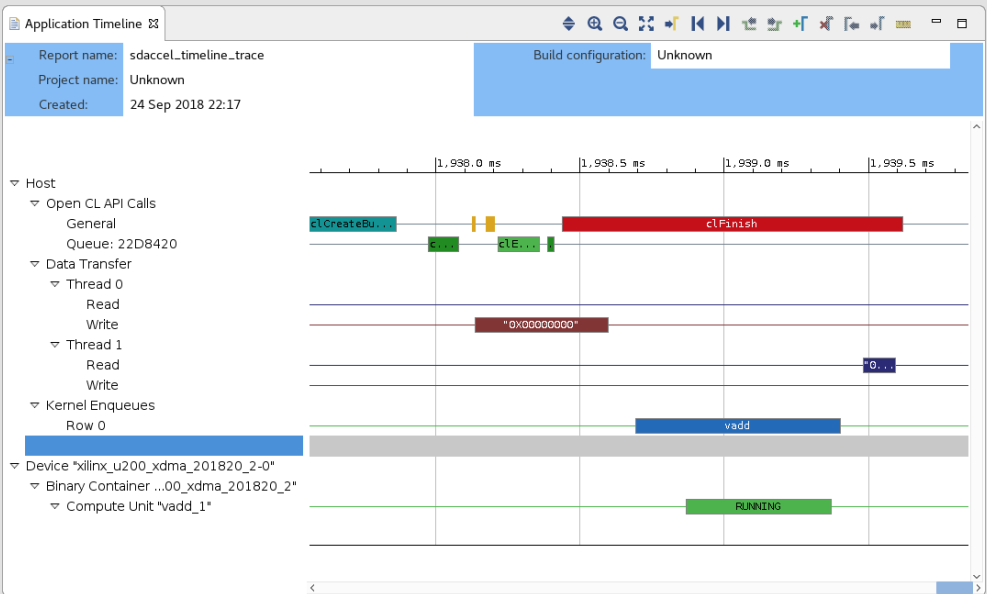
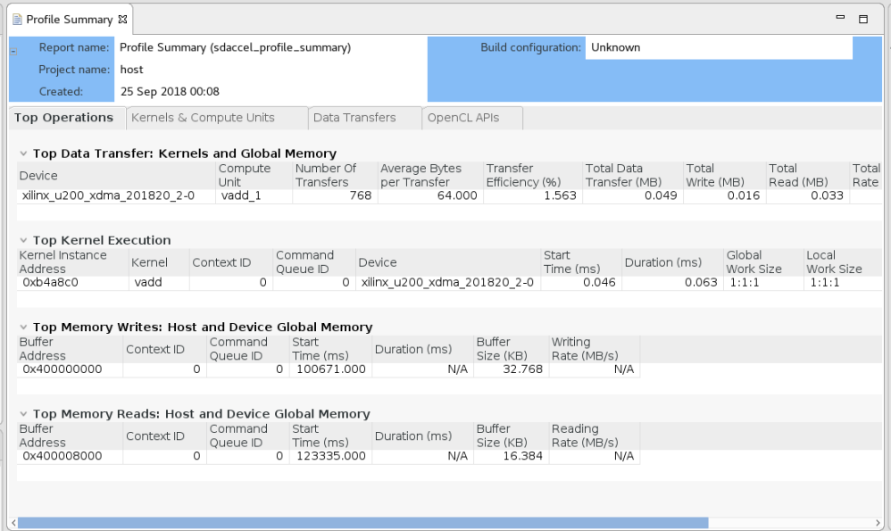

<table style="width:100%">
  <tr>
    <th width="100%" colspan="6"><h1>SDAccel 環境チュートリアル: 入門</h2>
</th>
  </tr>
    <tr>
    <td><a href="../../README.md">:house: HOME </a></td>
    <td colspan="2" align="center"><b>C/C++ カーネル入門</b></td>
  </tr> 
  <tr>
    <td align="center"><a href="README.md">はじめに</td>
    <td align="center"><a href="lab-1-introduction-to-the-sadccel-developmentenvironment.md">演習 1: SDAccel 開発環境の概要</td>
    <td align="center">演習 2: SDAccel makefile の概要</a></td>
  </tr>
</table>

## 演習 2: SDAccel makefile の概要  

この演習では、[ザイリンクス GitHub リポジトリ](https://github.com/Xilinx/SDAccel_Examples)からの SDAccel™ サンプル デザインを使用します。

<details>
<summary><strong>手順 1: SDAccel 環境の準備と設定</strong></summary>

この手順では、SDx™ をコマンド ラインで実行できるように設定し、SDAccel の GitHub リポジトリをクローンします。  

  1. ターミナルを起動し、次のコマンドを使用して SDx 環境にある設定スクリプトを読み込みます。
     ```
     source <SDx_install_location>/<version>/settings64.csh
     ```
     または
     ```
     source <SDx_install_location>/<version>/settings64.sh
     ```
     これにより、GUI を使用しなくても SDx コマンド ラインを実行できるようになります。  

  2. 演習 1 で説明されているように SDx IDE で SDAccel サンプルをダウンロードした場合は、その場所からファイルにアクセスできます。Linux では、ファイルは `/home/<user>/.Xilinx/SDx/<version>/sdaccel_examples/` にダウンロードされています。ファイルをワークスペースにダウンロードするには、次のコマンドを使用します。
     ```
     git clone https://github.com/Xilinx/SDAccel_Examples <workspace>/examples
     ```
     >**:pushpin: 注記:** この GitHub リポジトリの容量は約 400 MB です。ローカルまたはリモート ディスクにすべてを完全にダウンロードするのに十分な容量があるかどうかを確認してください。  

  3. ダウンロードが完了したら、次のコマンドを使用して SDAccel サンプルの `vadd` ディレクトリに移動します。  
     ```
     cd <workspace>/examples/getting_started/host/helloworld_c
     ```

     このディレクトリで `ls` コマンドを実行し、ファイルを確認します。次のものが含まれているはずです。
     ````
     [sdaccel@localhost helloworld_c]$ ls
     Makefile    README.md    description.json src utils.mk
     ````
     `src` ディレクトリで `ls` を実行した場合は、次のように表示されます。
     ````
     [sdaccel@localhost helloworld_c]$ ls src  
     host.cpp    vadd.cpp  
     ````
</details>

<details>
<summary><strong>手順 2: 初期デザインおよび makefile の確認</strong></summary>  

  1. helloworld_c ディレクトリには、デザインをハードウェアおよびソフトウェア エミュレーションの両方でコンパイルして、システム実行を生成するために使用する makefile ファイルが含まれます。

  2. テキスト エディターで makefile を開きます。内容を確認し、どのように記述されているかを見てみます。makefile は bash 形式の構文で記述されています。  
     >**:pushpin: 注記:** このファイル自体は、すべての GitHub サンプル デザインで使用される汎用 makefile を参照しています。  

  3. 最初の数行には、すべてのサンプルで使用されるほかの汎用 makefile の `include` 文が含まれます。  
     ````
     COMMON_REPO = ../../../
     ABS_COMMON_REPO = $(shell readlink -f $(COMMON_REPO))

     include ./utils.mk

     ````
  4. `../../../utility/boards.mk` ファイルを開きます。この makefile には、ホストおよびソース コードをビルドするのに必要なオプションおよびコマンド ライン コンパイラ情報が含まれます。   
     ````
     # By Default report is set to none, no report will be generated  
     # 'estimate' for estimate report generation  
     # 'system' for system report generation  
     REPORT:=none
     PROFILE ?= no
     DEBUG ?=no

     # Default C++ Compiler Flags and xocc compiler flags  
     CXXFLAGS:=-Wall -O0 -g -std=c++14
     CLFLAGS:= --xp "param:compiler.preserveHlsOutput=1" --xp "param:compiler.generateExtraRunData=true" -s  

     ifneq ($(REPORT),none)  
     CLFLAGS += --report $(REPORT)  
     endif

     ifeq ($(PROFILE),yes)
     CLFLAGS += --profile_kernel data:all:all:all
     endif

     ifeq ($(DEBUG),yes)
     CLFLAGS += --dk protocol:all:all:all
     endif

     ````
     `REPORT`、`PROFILE`、および `DEBUG` は、`make` コマンドの入力オプション (パラメーター) です。`CLFLAGS` は使用される `xocc` コマンド ライン オプションをリストします。  

  5. 52 行目までスクロールダウンします。  
     ````
        # By default build for hardware can be set to  
        #   hw_emu for hardware emulation  
        #   sw_emu for software emulation  
        #   or a collection of all or none of these  
        TARGETS:=hw  

        # By default only have one device in the system  
        NUM_DEVICES:=1  
     ````
     `TARGETS` はデフォルト ビルド (makefile コマンド ラインで指定しない場合) を定義します。デフォルトでは、`hw` (システム ビルド) に設定されています。この値をデザインに合わせて設定します。また、選択したボードに含まれるデバイスで、マシンで使用する数を定義できます。通常は、1 つのデバイスで十分ですが、必要に応じて数を増やすことができます。  

  6. boards.mk ファイルを閉じて、makefile を再度確認します。9 行目以降では、src ディレクトリにあるものが処理され、カーネルおよびアプリケーション実行ファイルが指定されています。  

  7. `../../../utility/rules.mk file` ファイルを開きます。このファイルでは、makefile で設定されたアイテムすべてが処理され、xocc および xcpp (gcc) コマンド ライン引数が作成されます。このファイルを詳細に確認し、内容を理解してください。特に、`define make_exe` (34 行目) および `define make_xclbin` (107 行目) に注目してください。

</details>

<details>
<summary><strong>手順 3: ソフトウェア エミュレーションの実行</strong></summary>

ここまでで makefile の構成部分を理解したので、次にソフトウェア エミュレーションを実行するコードをコンパイルします。  

  1. 次のコマンドを実行して、ソフトウェア エミュレーション用にアプリケーションをコンパイルします。  
     ```
     make all REPORT=estimate TARGETS=sw_emu DEVICES=xilinx_u200_xdma_201820_2
     ```  
     `TARGETS` をこのように定義すると、その値が渡されて、makefile で設定されているデフォルトが上書きされます。
     
     次の 4 つのファイルが生成されます。  

     * host (ホスト実行ファイル)  
     * `xclbin/vadd.sw_emu.xilinx_u200_xdma_201820_2.xclbin` (バイナリ コンテナー)  
     * システム見積もりレポート
     * `emconfig.json`

     これらのファイルが生成されていることを確認するため、ディレクトリで `ls` コマンドを実行します。次のように表示されるはずです。  
     ```
      [sdaccel@localhost helloworld_c]$ ls   
      description.json
      Makefile
      README.md
      src  
      host  
      _x  (this directory contains the logs and reports from the build process.)
      xclbin  
      [sdaccel@localhost helloworld_c]$ ls xclbin/  
      vadd.sw_emu.xilinx_u200_xdma_201820_2.xclbin  
      vadd.sw_emu.xilinx_u200_xdma_201820_2.xo
      xilinx_u200_xdma_201820_2 (this folder contains the emconfig.json file)
     ```

  2. 次のコマンドを実行して、アプリケーションのエミュレーションを実行します。  
     ```
     make check PROFILE=yes TARGETS=sw_emu DEVICES=xilinx_u200_xdma_201820_2
     ```  

     >**:pushpin: 注記:** 指定されている `DEVICES` が手順 1 のコンパイルに使用されたものと同じであることを確認してください。  

     このフローでは、これにより前のコマンドが実行されて、アプリケーションも実行されます。  

  3. アプリケーションの実行に問題がない場合は、ターミナルに次のメッセージが表示されます。  
      ```
      [sdaccel@localhost helloworld_c]$ make check TARGETS=sw_emu DEVICES=xilinx_u200_xdma_201820_2
      cp -rf ./xclbin/xilinx_u200_xdma_201820_2/emconfig.json .
      XCL_EMULATION_MODE=sw_emu ./host
      Found Platform
      Platform Name: Xilinx
      XCLBIN File Name: vadd
      INFO: Importing xclbin/vadd.sw_emu.xilinx_u200_xdma_201820_2.xclbin
      Loading: 'xclbin/vadd.sw_emu.xilinx_u200_xdma_201820_2.xclbin'
      TEST PASSED
      sdx_analyze profile -i sdaccel_profile_summary.csv -f html
      INFO: Tool Version : 2018.2
      INFO: Done writing sdaccel_profile_summary.html

      ```

  4. 追加のレポートを生成するには、環境変数を設定するか、`sdaccel.ini` というファイルを正しい情報と権限で作成する必要があります。
     このチュートリアルでは、`helloworld_c` ディレクトリに `sdaccel.ini` ファイルを作成して、次の内容を追加します。  
     ```
      [Debug]  
      timeline_trace = true  
      profile = true  
     ```

  5. 次のコマンドを実行します。  
     ```
     make check PROFILE=yes TARGETS=sw_emu DEVICES=xilinx_u200_xdma_201820_2
     ```  
     アプリケーションの実行が終了すると、sdaccel_timeline_trace.csv というタイムライン トレース ファイルも作成されます。このトレース レポートを GUI で確認するには、次のコマンドを使用して CSV ファイルを WDB ファイルに変換します。  
     ```
     sdx_analyze trace sdaccel_timeline_trace.csv
     ```  

  6. アプリケーションで `sdaccel_profile_summary` という CSV 形式のプロファイリング サマリ レポートが生成されます。  
     これを演習 1 のプロファイル サマリで示したレポートに変換して、SDx IDE で表示できます。これには、次のコマンドを実行します。  
     ```
     sdx_analyze profile sdaccel_profile_summary.csv
     ```  
     これにより、`sdaccel_profile_summary.xprf` ファイルが生成されます。このレポートを表示するには、SDx IDE を開き、**[File] → [Open File]** をクリックして、ファイルを選択します。次の図に、レポートが表示されたところを示します。  
     >**:pushpin: 注記:** これらのレポートを表示するのに、演習 1 で使用したワークスペースを使用する必要はありません。`sdx -workspace ./lab2` コマンドを使用して、これらのレポートを表示するためのワークスペースをローカルに作成できます。レポートを表示するために、[Welcome] ウィンドウを閉じる必要があることもあります。  

       

     >**:pushpin: 注記:** ソフトウェア エミュレーションでは、すべてのプロファイル情報が含まれるわけではなく、カーネルとグローバル メモリ間のデータ転送に関する情報は含まれません。この情報は、ハードウェア エミュレーションおよびシステムにのみ含まれます。  

  7. システム見積もりレポート (`system_estimate.xtxt`) も生成されます。これは `xocc` コマンドで `--report` オプションを指定してコンパイルすると生成されます。  
       

  8. SDx IDE を起動します。

  9. **[File] → [Open File]** をクリックし、`sdaccel_timeline_trace.wdb` ファイルを選択します。次の図に示すようなレポートが表示されます。  
       
</details>

<details>
<summary><strong>手順 4: ハードウェア エミュレーションの実行</strong></summary>

  1. ソフトウェア エミュレーションが終了したので、次はハードウェア シミュレーションを実行します。makefile を変更せずにこれを実行するには、次のコマンドを実行します。  
     ```
     make all REPORT=estimate TARGETS=hw_emu DEVICES=xilinx_u200_xdma_201820_2
     ```
     `TARGETS` をこのように定義すると、その値が渡されて、makefile で設定されているデフォルトが上書きされます。  
     >**:pushpin: 注記:** ハードウェア エミュレーションには、ソフトウェア エミュレーションよりも時間がかかります。  
  2. コンパイルされたホスト アプリケーションを再実行します。デバイス情報は変更していないので `emconfig.json` を生成し直す必要はありませんが、エミュレーションをハードウェア エミュレーションに設定する必要があります。  

  2. 次のコマンドを使用してホスト アプリケーションを再実行します。  
     ```
     make check TARGETS=hw_emu DEVICES=xilinx_u200_xdma_201820_2
     ```  
     >**:pushpin: 注記:** makefile で環境変数が `hw_emu` に設定されます。  

  3. 出力はソフトウェア エミュレーションと類似しており、次のようになります。  
     ```
      [sdaccel@localhost helloworld_c]$ make check TARGETS=hw_emu DEVICES=xilinx_u200_xdma_201820_2
      cp -rf ./xclbin/xilinx_u200_xdma_201820_2/emconfig.json .
      XCL_EMULATION_MODE=hw_emu ./host
      Found Platform
      Platform Name: Xilinx
      XCLBIN File Name: vadd
      INFO: Importing xclbin/vadd.hw_emu.xilinx_u200_xdma_201820_2.xclbin
      Loading: 'xclbin/vadd.hw_emu.xilinx_u200_xdma_201820_2.xclbin'
      INFO: [SDx-EM 01] Hardware emulation runs simulation underneath.  Using a large data set will result in long simulation times.  It is recommended that a small dataset is used for faster execution.  This flow does not use cycle accurate models and hence the performance data generated is approximate.
      TEST PASSED
      INFO: [SDx-EM 22] [Wall clock time: 00:10, Emulation time: 0.109454 ms] Data transfer between kernel(s) and global memory(s)
      vadd_1:m_axi_gmem          RD = 32.000 KB              WR = 16.000 KB       

      sdx_analyze profile -i sdaccel_profile_summary.csv -f html
      INFO: Tool Version : 2018.2
      Running SDx Rule Check Server on port:40213
      INFO: Done writing sdaccel_profile_summary.html
     ```

  4. 次のコマンドを実行し、プロファイル サマリとタイムライン トレースを SDx IDE で表示できるように変換し、アップデートされた情報を表示します。  
     ```
      sdx_analyze profile sdaccel_profile_summary.csv  
      sdx_analyze trace sdaccel_timeline_trace.csv  
     ```
     プロファイル サマリは、次の図のようになります。  
         
</details>

<details>
<summary><strong>手順 5: システム実行</strong></summary>

  1. 次のコマンドを実行し、システム実行用にコンパイルします。  
     ```
     make all TARGETS=hw DEVICES=xilinx_u200_xdma_201820_2
     ```  
     >**:pushpin: 注記:** システムのビルドには、コンピューター リソースによって時間がかかることがあります。  

  2. ビルドが終了したら、次のコマンドを使用してボードのインストールを準備します。  
     ```
     xbinst --platform xilinx_u200_xdma_201820_2 -z -d .
      ```  
     説明:  
     * `--platform`: デザインで使用されるプラットフォーム名を指定します。  
     * `-z`: 運用のためボード インストール ファイルをアーカイブします。  
     * `-d`: デスティネーション ディレクトリを指定します (必須)。  

  3. 終了すると、デザインの運用に必要なファイルおよびスクリプトをすべて含む `xbinst` というフォルダーが作成されます。これには、`install.sh` スクリプトを実行します。このスクリプトにより、適切なライブラリおよびファームウェアがインストールされ、ランタイム環境を設定するための setup.sh が作成されます。  

  4. setup.sh を実行してランタイム環境を準備します。  
     >**:pushpin: 注記:** setup.sh を実行するには、引き上げられた権限が必要です。  

  5. システム実行が終了したら、次のコマンドを再実行できます。  
     ```
     make check TARGETS=hw DEVICES=xilinx_u200_xdma_201820_2
     ```  


  6. 次のコマンドを使用して、プロファイル サマリとタイムライン トレースを SDx で読み込むことができるファイルに変換します。
     ```
      sdx_analyze profile sdaccel_profile_summary.csv  
      sdx_analyze trace sdaccel_timeline_trace.csv      
     ```
</details>

### まとめ

このチュートリアルを終了すると、次ができるようになります。  

  * SDx 環境を設定し、すべてのコマンドをターミナルで実行。  
  * GitHub リポジトリをクローン。  
  * xcpp、xocc、emconfigutil、sdx_analyze profile、sdx_analyze trace コマンドを実行してアプリケーション、バイナリ コンテイナー、エミュレーション モデルを生成。  
  * makefile を記述して OpenCL™ カーネルおよびホスト コードをコンパイル。  
  * エミュレーションから生成したファイルをテキスト エディターまたは SDx IDE で表示。  
  * 環境を設定し、デザインをプラットフォームで使用されるように運用。  
</details>

  <hr/>
  <p align="center"><sup>Copyright&copy; 2018 Xilinx</sup></p>
